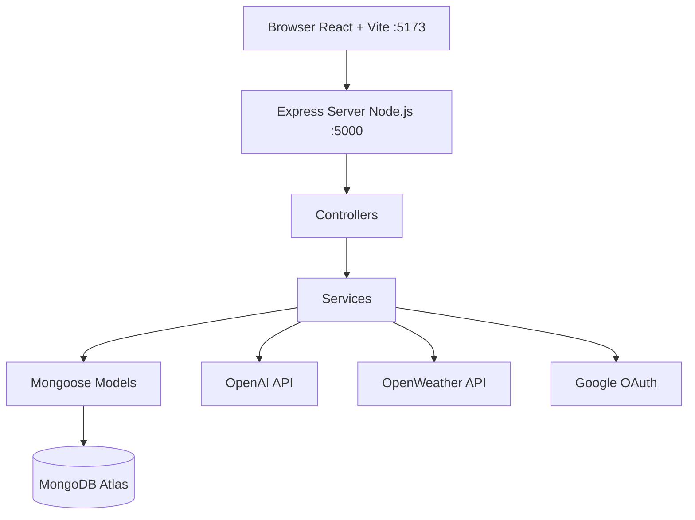

# Arquitetura do Sistema

## Visão Geral

O sistema TourEase utiliza arquitetura cliente-servidor baseada em aplicações web modernas.

A aplicação é dividida em:
- Frontend React com Vite
- Backend Node.js/Express
- Banco MongoDB
- APIs externas para IA, clima e autenticação

## Estilo Arquitetural

O sistema segue arquitetura em camadas:

- Camada de apresentação
- Camada de serviços
- Camada de controle
- Camada de persistência

## Justificativa

A separação entre frontend e backend melhora:
- manutenção
- escalabilidade
- desacoplamento
- reutilização
- testabilidade

## Fluxo de Comunicação

O frontend envia requisições HTTP REST para o backend utilizando JSON.

O backend processa:
- autenticação
- lógica de negócio
- integração com APIs externas
- persistência MongoDB

## Diagrama de Arquitetura

# Justificativa Arquitetural

A separação entre frontend e backend oferece:
- maior desacoplamento
- facilidade de manutenção
- escalabilidade
- reutilização de componentes
- melhor organização do código
- facilidade para testes e evolução do sistema
A utilização de componentes React também melhora reutilização e modularidade da interface.
